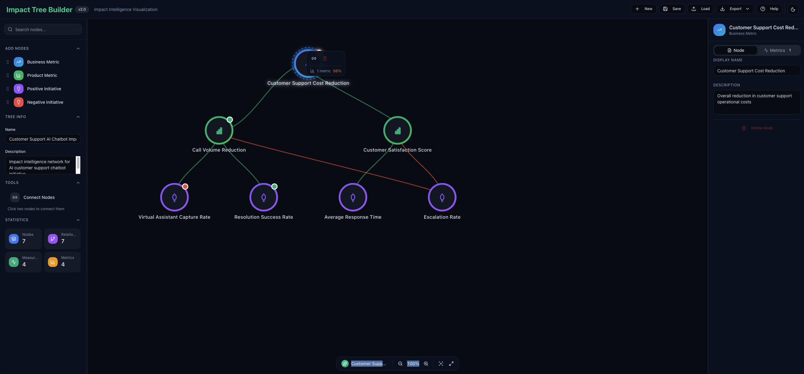

# Impact Tree Builder

A fully-featured impact tree visualization tool built with React, TypeScript, Vite, Tailwind CSS, and shadcn-ui.



## 🚀 Tech Stack

- **Vite** - Next-generation frontend tooling
- **React 18** - UI library
- **TypeScript** - Type safety
- **Tailwind CSS** - Utility-first CSS framework
- **shadcn-ui** - Beautiful, accessible component library
- **Lucide React** - Modern icon set


## ✨ Features

### Core Functionality

- ✅ Interactive impact tree visualization with SVG
- ✅ Multiple node types: Business Metrics, Product Metrics, Initiatives
- ✅ Relationship mapping with visual indicators
- ✅ Drag-and-drop node positioning
- ✅ Node property editing
- ✅ Measurement tracking with performance indicators
- ✅ Canvas controls (zoom, pan, reset, center)
- ✅ Save/Load functionality
- ✅ Export to JSON, PNG, and HTML
- ✅ Real-time statistics

### Modern Enhancements

- 🎨 Modern, clean UI with shadcn-ui components
- 🌓 Dark mode support (system preference)
- 📱 Responsive design
- ⚡ Lightning-fast with Vite
- 🔒 Type-safe with TypeScript
- 🎯 Accessible components
- 🎭 Smooth animations and transitions
- 💅 Professional styling with Tailwind CSS

## 🛠️ Development

### Prerequisites

- Node.js 18+
- [Bun](https://bun.sh/) (recommended) or npm

### Installation

```bash
# Install dependencies
bun install

# Start development server
bun run dev

# Build for production
bun run build

# Preview production build
bun run preview
```

The app will be available at `http://localhost:5173/`

### Testing

See [docs/TESTING.md](docs/TESTING.md) for the complete testing strategy.

#### Running Tests

```bash
# Run tests in watch mode (for development)
bun run test

# Run tests once (for CI/CD)
bun run test:run

# Run tests with coverage report
bun run test:coverage

# Open Vitest UI (interactive test runner)
bun run test:ui
```

## 📁 Project Structure

```
impact-tree-builder/
├── src/
│   ├── components/           # React components
│   │   ├── ui/              # shadcn-ui base components
│   │   ├── __tests__/       # Component unit tests
│   │   ├── ImpactTreeApp.tsx
│   │   ├── ImpactCanvas.tsx
│   │   ├── Sidebar.tsx
│   │   └── PropertiesPanel.tsx
│   ├── hooks/               # Custom React hooks
│   ├── lib/                 # Utility functions
│   ├── types/               # TypeScript type definitions
│   ├── data/                # Sample data files
│   ├── App.tsx
│   ├── main.tsx
│   └── index.css
├── e2e/                     # Playwright E2E tests
├── docs/                    # Documentation
│   ├── TESTING.md          # Testing strategy
│   └── archive/            # Historical docs
├── specs/                   # Feature specifications
└── dist/                    # Production build output
```

## 🎯 Usage

### Adding Nodes

**Method 1: Click to Add**

1. Select a node type from the left sidebar (Business Metric, Product Metric, or Initiative)
2. Click anywhere on the canvas to place the node
3. Edit the node properties in the right panel

**Method 2: Drag and Drop** ✨ NEW

1. Drag a node type button from the left sidebar
2. Drop it onto the canvas at your desired location
3. The node is created instantly where you drop it

**Keyboard Shortcuts:**

- `B` - Select Business Metric
- `P` - Select Product Metric
- `I` - Select Initiative (Positive)
- `N` - Select Initiative (Negative)
- `Escape` - Cancel current operation

### Creating Relationships

**Method 1: Click to Connect**

1. Click "Connect Nodes" in the left sidebar (or press `C`)
2. Select the relationship type (Desirable Effect, Undesirable Effect, or Rollup)
3. Click on two nodes to create a relationship

**Method 2: Drag to Connect** ✨ NEW

1. Click "Connect Nodes" in the left sidebar (or press `C`)
2. Drag from a source node to a target node
3. A preview line shows during the drag (orange → green when hovering target)
4. Release to create the relationship

**Keyboard Shortcuts:**

- `C` - Enter Connect Nodes mode
- `S` - Return to Select mode
- `Escape` - Cancel relationship creation

### Moving Nodes

- Simply drag and drop nodes to reposition them on the canvas
- Auto-pan: When dragging near the viewport edge, the canvas automatically pans

### Adding Measurements

1. Select a node
2. Click the "+" button in the Measurements section
3. Fill in the measurement details
4. Performance indicators will automatically update

### Canvas Controls

- **Zoom In/Out** - Use the + and - buttons (or mouse wheel)
- **Reset View** - Return to default zoom and position
- **Center View** - Center the canvas on all nodes
- **Auto-Pan** - When dragging nodes near viewport edges, canvas automatically pans in that direction

### Keyboard Shortcuts Summary

| Key      | Action                     |
| -------- | -------------------------- |
| `B`      | Business Metric mode       |
| `P`      | Product Metric mode        |
| `I`      | Initiative (Positive) mode |
| `N`      | Initiative (Negative) mode |
| `C`      | Connect Nodes mode         |
| `Escape` | Cancel current operation   |

### Saving and Exporting

- **Save** - Saves to browser localStorage
- **Load** - Loads from browser localStorage
- **Export** - Downloads as JSON, PNG image, or self-contained HTML file

## 📦 Building for Production

```bash
bun run build
```

The optimized build will be in the `dist/` folder, ready to deploy to any static hosting service.

## 📝 License

MIT

## 🤝 Contributing

Contributions are welcome! Please feel free to submit a Pull Request.

## 📧 Support

For issues and questions, please open an issue on GitHub.
