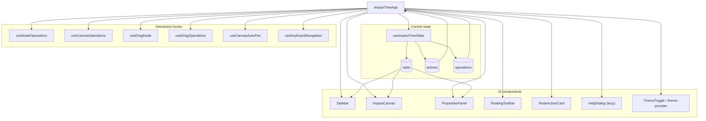
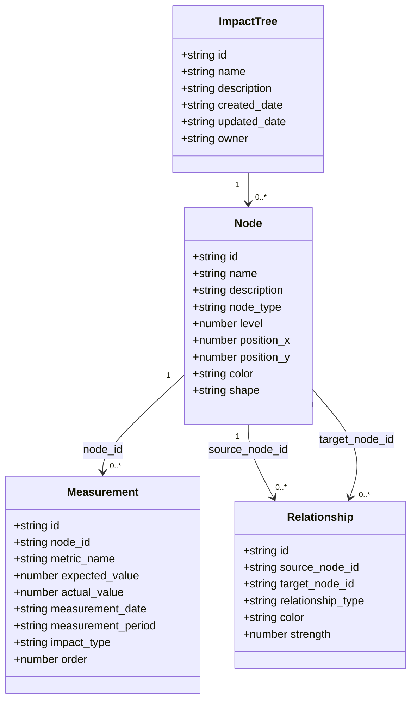
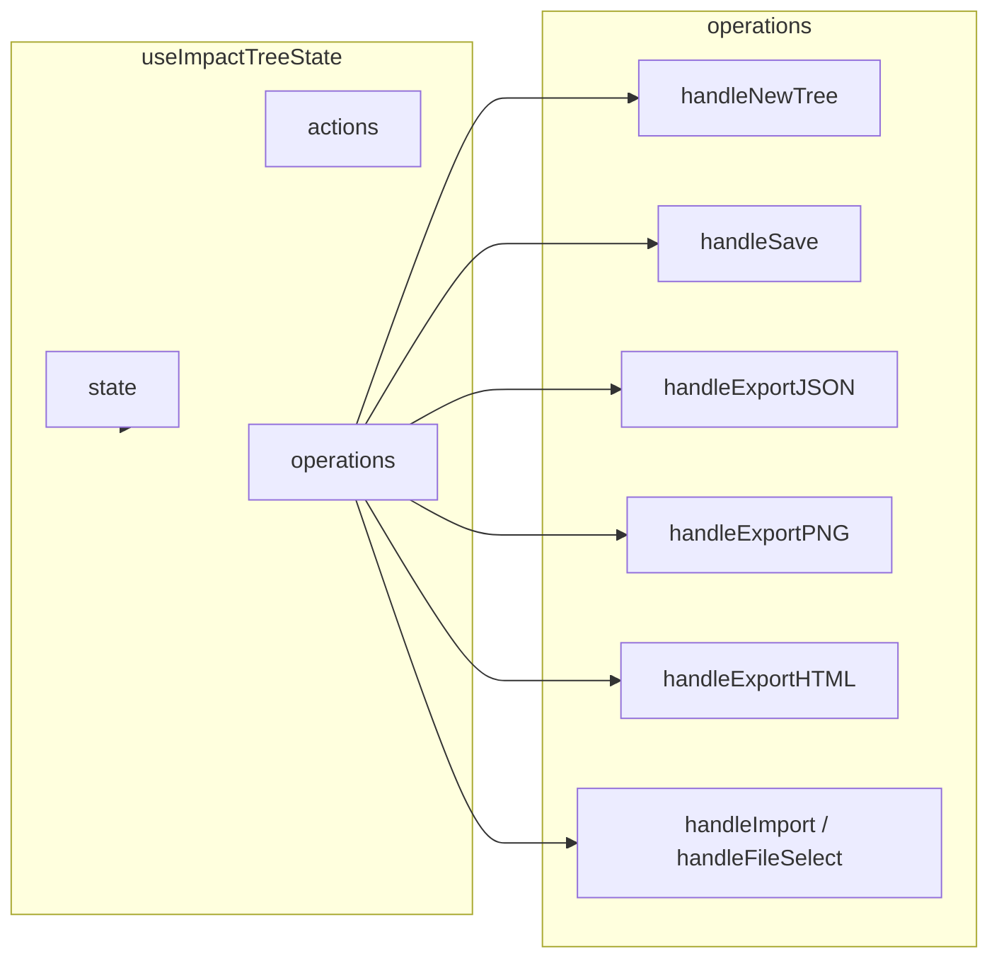
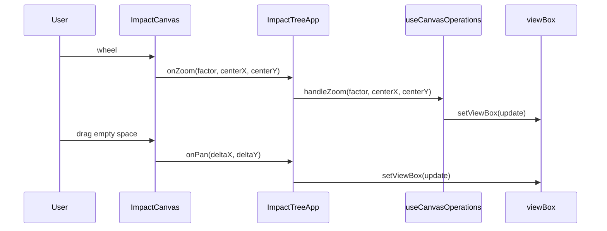
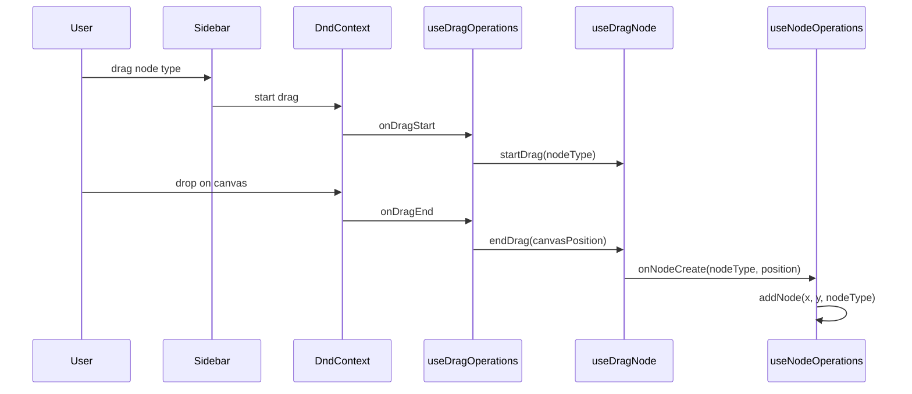
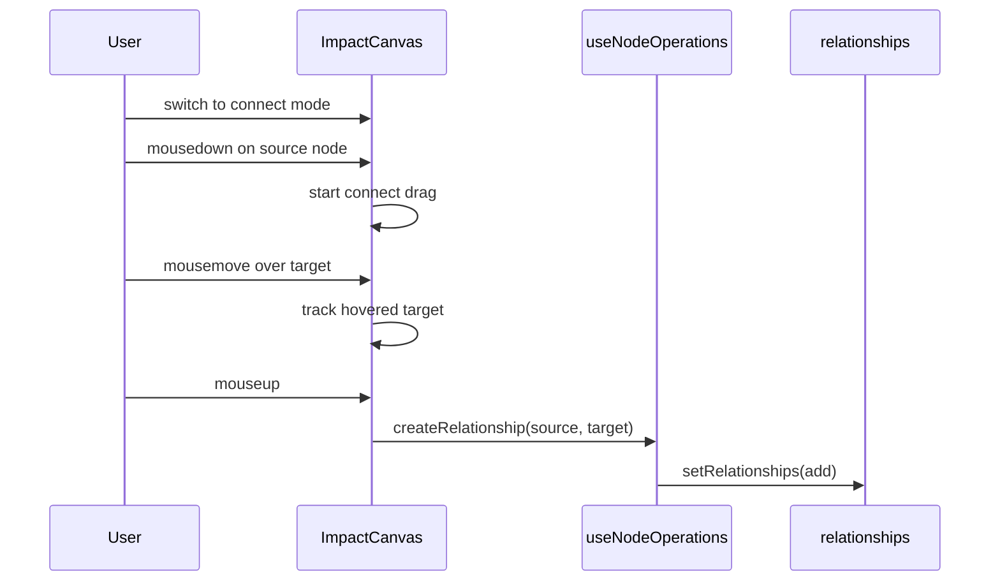
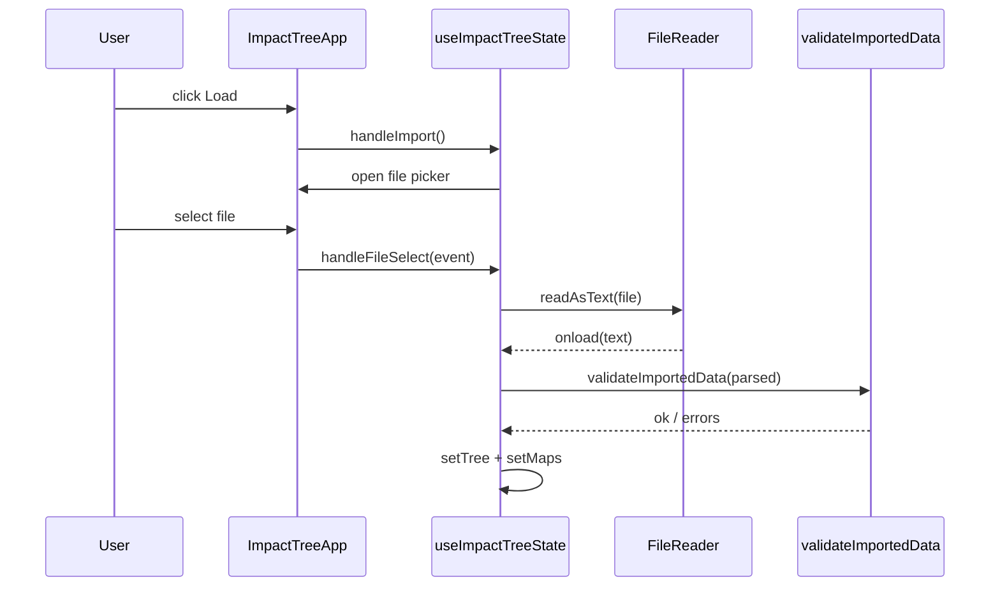
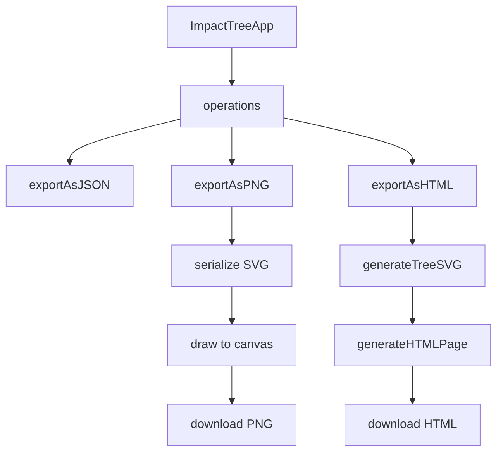

# Architecture

This document describes the current architecture of **Impact Tree Builder** (React + TypeScript + Vite), focusing on how UI components, hooks, and the core data model fit together.

> Notes
> - This doc is intended to stay close to the implementation. If behavior changes, please update the relevant sections and diagrams.
> - Source code pointers use the `@/` alias (mapped to `src/`).

---

## System Overview

Impact Tree Builder is a single-page application that lets users:
- Create and edit nodes (business metrics, product metrics, initiatives)
- Connect nodes with typed relationships
- Attach measurements to nodes
- Navigate an SVG “infinite canvas” via pan/zoom
- Save/load/export the tree in multiple formats

### Main runtime building blocks

- **UI composition**: `ImpactTreeApp` orchestrates the layout and wires state + operations into child components.
- **Central state**: `useImpactTreeState` owns the data and view state and exposes `state`, `actions`, and `operations`.
- **Domain operations**: `useNodeOperations` and `useCanvasOperations` implement most “business logic” for editing and viewport manipulation.
- **Canvas interactions**:
  - Drag-to-create (sidebar → canvas): `useDragNode` + `useDragOperations`
  - Auto-pan while dragging: `useCanvasAutoPan`
  - Keyboard shortcuts: `useKeyboardNavigation`

Key entry points:
- UI root: `src/components/ImpactTreeApp.tsx`
- State hook: `src/hooks/useImpactTreeState.ts`
- Canvas: `src/components/ImpactCanvas.tsx`

---

## High-level component diagram (UI + hooks)

### Key responsibilities

- `ImpactTreeApp` (`src/components/ImpactTreeApp.tsx`)
  - Instantiates the DnD context (`@dnd-kit/core`) and wires drag handlers.
  - Coordinates major layout regions: sidebar, canvas, properties panel.
  - Passes core maps (`nodes`, `relationships`, `measurements`) and selection/mode to children.

- `ImpactCanvas` (`src/components/ImpactCanvas.tsx`)
  - Renders an SVG canvas:
    - nodes (circles + gradients)
    - relationships (bezier paths + arrows)
    - interaction preview (connect drag preview line)
  - Handles local, pointer-based interaction for:
    - click selection
    - node dragging (move nodes)
    - pan
    - connect-drag (drag from node to node to create relationship)
    - wheel zoom (delegates to `onZoom`)

- `Sidebar` / `PropertiesPanel`
  - `Sidebar` drives mode changes and tree/node tooling (node type selection, stats, etc.).
  - `PropertiesPanel` edits the currently selected node/relationship and manages measurements.

---

## Data model overview

The core domain is defined in `src/types/index.ts`.

### Entities

- **ImpactTree**: overall document metadata
- **Node**: typed node in the tree
- **Relationship**: directed edge between nodes
- **Measurement**: time-based datapoint attached to a node
- **TreeData**: import/export container

### Storage shapes used in state

The app uses `Map<string, T>` for in-memory collections:
- `nodes: Map<string, Node>`
- `relationships: Map<string, Relationship>`
- `measurements: Map<string, Measurement>`

For import/export and persistence, the data is serialized as arrays (see `TreeData` and `exportAsJSON`).

### Node types: stored vs. UI variants

`Node.node_type` supports:
- Stored/legacy: `"initiative"` (backward compatibility)
- UI variants: `"initiative_positive"`, `"initiative_negative"`

See:
- `src/types/index.ts` (`Node.node_type` docstring)
- `src/lib/node-utils.ts` (`NODE_TYPE_CONFIG`, labels, visual properties)

---

## State management flow

### Central state: `useImpactTreeState`

`useImpactTreeState` is the single source of truth for:
- Core data: tree, nodes, relationships, measurements
- UI interaction state: selection and modes
- Viewport state: `viewBox`
- File operations: save/import/export (JSON/PNG/HTML)

Source: `src/hooks/useImpactTreeState.ts`

It returns:
- `state`: immutable-ish snapshot (by convention)
- `actions`: React `setState` dispatchers
- `operations`: higher-level functions that may combine multiple state updates and side effects

### Domain actions implemented as hooks

While `useImpactTreeState` owns the state, much of the “domain logic” is implemented in dedicated hooks and invoked by `ImpactTreeApp`:

- `useNodeOperations` (`src/hooks/useNodeOperations.ts`)
  - `addNode(x, y, nodeType?)`
  - `updateNode(nodeId, updates)`
  - `deleteNode(nodeId)` (also removes related relationships + measurements)
  - `createRelationshipDirect(sourceId, targetId)`
  - `handleNodeClickForConnect(nodeId)` (two-click connect flow)

- `useCanvasOperations` (`src/hooks/useCanvasOperations.ts`)
  - `handleZoom(factor, centerX?, centerY?)`
  - `handleResetView()`
  - `handleCenterView()` (fits view to node bounds)

---

## Canvas interaction flows

The canvas is rendered as an SVG with a `viewBox` driven by the `viewBox` state.

### Pan / Zoom

- **Pan** is implemented in `ImpactCanvas` (mouse drag on empty space, in select mode).
  - It computes deltas in canvas coordinates based on the current `viewBox.scale`.
  - It calls `onPan(deltaX, deltaY)`.
  - `ImpactTreeApp` implements `onPan` by updating the `viewBox` in state.

- **Zoom** is triggered by mouse wheel on the canvas.
  - `ImpactCanvas` computes a zoom factor and passes a canvas-space center point.
  - `useCanvasOperations.handleZoom()` clamps scale (`MIN_ZOOM`/`MAX_ZOOM`) and adjusts `x/y` when a zoom center is provided.

### Drag-to-create node (sidebar → canvas)

This flow uses `@dnd-kit/core` with a droppable “canvas-drop-zone”.

Key pieces:
- `useDragNode` holds drag state and calls `onNodeCreate(nodeType, position)` when a drop completes.
- `useDragOperations` translates the DnD event into canvas coordinates (using `screenToCanvasCoordinates`).

Source pointers:
- `src/hooks/useDragNode.ts`
- `src/hooks/useDragOperations.ts`
- `src/lib/drag-utils.ts` (`screenToCanvasCoordinates`)

### Move node (drag within canvas)

Inside `ImpactCanvas` (local state `dragState`):
- In **select mode**, `onMouseDown` over a node begins node-drag.
- `onMouseMove` computes `deltaX/deltaY` in canvas coordinates based on `viewBox.scale` and calls `onNodeUpdate(nodeId, { position_x, position_y })`.

Source pointers:
- `src/components/ImpactCanvas.tsx` (dragState + mouse handlers)

### Connect nodes (drag-to-connect)

In **connect mode**, `ImpactCanvas` supports dragging from a source node to a target node:
- Mouse down on a node starts a connect drag (`connectDragState`).
- Mouse move tracks hovered target node (via `closest([data-node-id])`).
- Mouse up creates the relationship if a target is hovered.

Relationship creation is delegated back to `useNodeOperations.createRelationshipDirect()`.

### Auto-pan while dragging near edges

When the user is dragging a node type from the sidebar, the app can auto-pan the canvas if the cursor approaches the viewport edges.

- `ImpactTreeApp` continuously tracks cursor position via a global `mousemove` listener.
- `useCanvasAutoPan` runs a `requestAnimationFrame` loop during drag (`enabled: isDragging`) and calls `onPan` with scaled deltas.

Source: `src/hooks/useCanvasAutoPan.ts`

---

## Import / export flows

### Save (browser storage)

- `useImpactTreeState.handleSave()` serializes `{tree, nodes[], relationships[], measurements[]}` and stores it in `localStorage`.

Source: `src/hooks/useImpactTreeState.ts`

### Import JSON

- `handleImport()` triggers a hidden file input.
- `handleFileSelect()` reads the file, parses JSON, validates it via `validateImportedData`, and then replaces all core state maps.

Validation:
- `src/lib/validation-utils.ts` (`validateImportedData`)

### Export JSON / PNG / HTML

Exports are implemented in `src/lib/export-utils.ts`:

- **JSON**: `exportAsJSON({ tree, nodes, relationships, measurements })`
- **PNG**: `exportAsPNG(tree, canvasElement)`
  - Serializes the SVG and draws it to an HTML canvas at higher resolution (`EXPORT.pngScale`).
- **HTML**: `exportAsHTML({ tree, nodes, relationships, measurements })`
  - Generates a self-contained HTML page with:
    - a static SVG rendering (via `generateTreeSVG`)
    - lists of nodes/relationships/measurements

---

## Key files and directories

### Components (`src/components/`)

- `ImpactTreeApp.tsx`: top-level composition; wires state/hooks to UI
- `ImpactCanvas.tsx`: SVG renderer and canvas input handling
- `Sidebar.tsx`: mode switching, node type palette, summary/stats
- `PropertiesPanel.tsx`: edit selected node/relationship and measurements
- `FloatingToolbar.tsx`: zoom/reset/center controls
- `NodeActionCard.tsx`: contextual actions for the selected node
- `HelpDialog.tsx`: keyboard shortcuts and help content (lazy loaded)
- `theme-provider.tsx`, `theme-toggle.tsx`: theme handling

### Hooks (`src/hooks/`)

- `useImpactTreeState.ts`: central state + file operations
- `useNodeOperations.ts`: node + relationship CRUD
- `useCanvasOperations.ts`: zoom/reset/center
- `useDragNode.ts`: DnD state machine for node creation
- `useDragOperations.ts`: integrates `@dnd-kit` events with app logic
- `useCanvasAutoPan.ts`: auto-pan loop during drag near edges
- `useKeyboardNavigation.ts`: keyboard shortcuts

### Libraries / utilities (`src/lib/`)

- `constants.ts`: rendering and interaction constants
- `drag-utils.ts`: screen↔canvas coordinate transforms
- `export-utils.ts`: export JSON/PNG/HTML
- `validation-utils.ts`: import validation
- `node-utils.ts`: node type configuration and labels

### Types (`src/types/`)

- `index.ts`: core domain model + `TreeData`
- `drag.ts`: drag state types + keyboard shortcut constants

---

## Design notes and constraints

- **Maps in state**: React state stores `Map` instances. Most updates create new `Map(...)` wrappers to ensure referential changes (e.g., `new Map(prev.set(...))`).
- **Canvas coordinates**: Input events often begin in screen coordinates. `screenToCanvasCoordinates` provides a robust transform (native SVG CTM when available, manual fallback).
- **Exports are not 1:1 with the on-screen SVG**:
  - The PNG export uses the real SVG DOM.
  - The HTML export uses a “legacy” `generateTreeSVG` representation using rectangle/ellipse nodes for portability.
